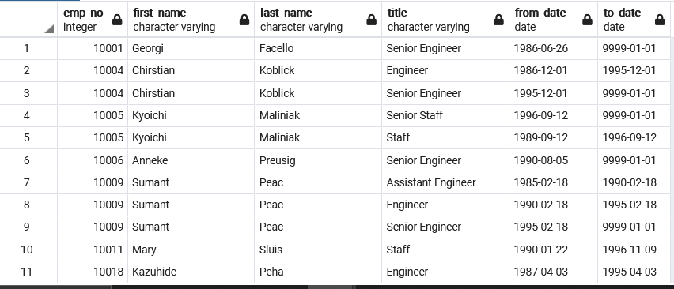
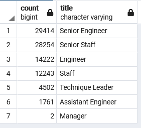
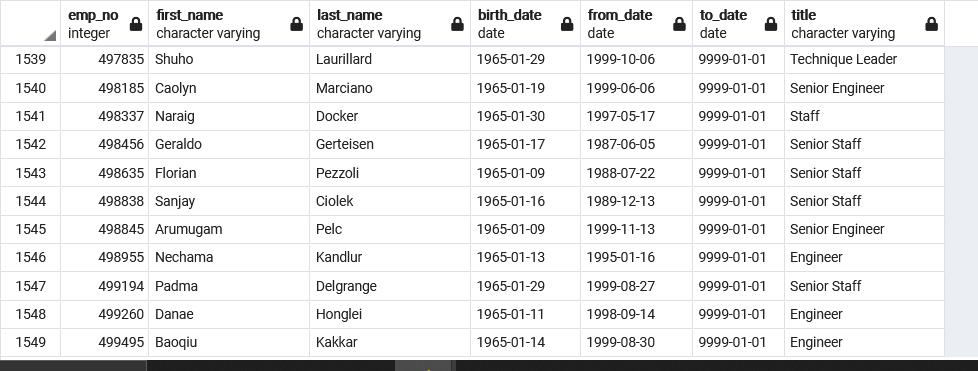

# Pewlett_Hackard_Analysis

### Overview of analysis
  The purpose of this analysis was to use 6 different csv files to manipulate the data within them using PostgreSQL. Specifically to determine the number of individuals soon leaving into retirement at Pewlett Hackard. Initially in the early analysis we determined the number of individuals leaving per department however later was tasked with specically determining the unique individuals names and titles. Then providing a list of those who will begin a mentorship program to train oncoming employees.
  
### Results

  Using various conditionals in PostgreSQL using PGadmin4 I was able to aggregate the varying data and determine those titles who be retiring. Below are some examples resulting from the analysis:
  1. First I was tasked with retrieving all of the names and titles of those retiring soon, however I found that there were several duplicate employee numbers with differing title positions. It can be concluded by the from and to date that these employees had changed titles.
  ##### Table with duplicates
  
  2.Using the following code I was able to return a more accurate table making use of the DISTINCT ON function in PostgreSQL on the first occurrence of the employee number:
 ```
 -- Use Dictinct with Orderby to remove duplicate rows
SELECT DISTINCT ON (rt.emp_no) rt.emp_no,
	rt.first_name,
	rt.last_name,
	rt.title
INTO unique_titles
FROM retirement_titles as rt
ORDER BY rt.emp_no, rt.to_date DESC;
```
 
  3. Using the unique titles table I was able to use the group by and count fuction to see at a glance how many employees of a specific title was going to retire:
##### Table of titles counted being retired and in need of being replaced

 
 
  4. Lastly I was tasked with determining the number of eligible employees who qualify for a mentorship program to train those coming into the company. Using the distinct on function, filtering the birth dates and to dates for the current employees I was able to return a table of 1500 inviduals who qualify.
###### Mentorship eligibilty table


### Summary
  Upon conclusion of the analysis made above it can be gathered that there are roughly 91,000+ employees who will be ready for retirement at this moment. It can inferred that roughly the same amount of new employees will be needed to fill those vacting positions. It would be in the companys best interest to immediatly begin training  and hiring new employees to fill those roles. With the mentorship program in mind it can be said that there are not enough mentor eligible employees to largly train the oncoming vacancy resulting from the silver tsunami that is approaching. Additional queries that could be made would be perhaps expanding and begining the mentorship program earlier so that the impact of the silver tsunami be lessened, also routinely updating the query to determine those who are within retirement eligibilty so that the company can make the appropriate preparations and possibly including them in the mentorship program
